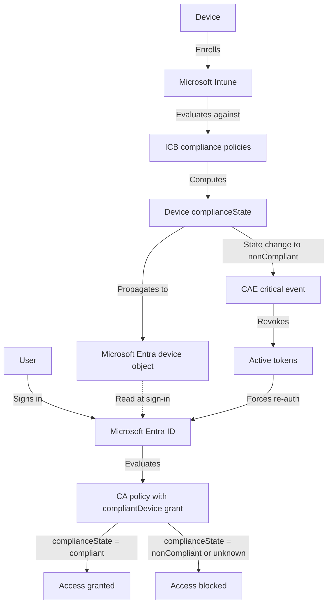

# Conditional Access Baseline — Intune Compliance Baseline Integration

Cross-framework integration specification: how the v1.3 Conditional Access Baseline consumes the Intune Compliance Baseline compliance signal. This document is required reading before enforcing CA-COV008-Internal-RequireCompliantDeviceOnDesktops, CA-SIG001-SensitiveApps-RequireCompliantDevice, or CA-SIG007-Internal-TokenProtection.

---

## 1. Introduction

Three policies in the v1.3 Conditional Access Baseline depend on a device compliance signal that originates outside the CA framework entirely:

- **CA-COV008-Internal-RequireCompliantDeviceOnDesktops** — uses a `compliantDevice` or `domainJoinedDevice` grant control for Internal users on Windows, macOS, and Linux. Either the device is Intune-compliant or it is hybrid Azure AD joined; if neither is true, access is blocked regardless of the user's authentication strength or risk level.
- **CA-SIG001-SensitiveApps-RequireCompliantDevice** — applies the same `compliantDevice` or `domainJoinedDevice` grant for Internal users accessing Azure Service Management. The highest-value application in most Microsoft 365 tenants cannot be reached from an unmanaged device.
- **CA-SIG007-Internal-TokenProtection** — enables `secureSignInSession` for Internal users on Windows accessing the Office365 bundle. Token Protection binds the refresh token and Primary Refresh Token to the issuing device's TPM key. This binding requires a managed device state — Intune enrollment or hybrid Azure AD join — to function correctly. Without managed device state, the TPM key is unavailable and the binding cannot be established.

Each of these policies depends on a populated device compliance signal in Microsoft Entra. That signal does not appear unless an Intune compliance policy evaluates against the device. The Intune Compliance Baseline defines those evaluation rules.

### 1.1 The dependency problem

The dependency is directional, and the failure mode is not obvious to end users. Without ICB:

- The CA `compliantDevice` grant becomes an empty checkbox that is never satisfied. When no Intune compliance policy is assigned to a device, Microsoft Entra sets the device's `complianceState` to `unknown`. A CA policy checking for `complianceState: compliant` will fail on an `unknown` device.
- The user is blocked with a "device not compliant" error even though their device may be fully secured. The error message is accurate from the CA engine's perspective — the device is not compliant in the sense that it has never been evaluated — but it is confusing to users who know their device is managed.
- There is no self-service remediation path. The Intune Company Portal app shows no noncompliance reasons because no evaluation has occurred. Users who follow the Company Portal guidance will find nothing to fix.

Without CA, the ICB compliance state is descriptive but does not gate access to any application. Devices are evaluated, states are set, and nothing acts on them. The evaluation signal is present and accurate but has no enforcement consequence.

The two frameworks are designed to ship together. Neither is fully effective without the other.

### 1.2 Document scope

This document covers:

- How a device transitions from enrollment through compliance evaluation to a satisfied CA grant control (Sections 2 and 3).
- The per-policy ICB requirements for each of the three CA policies, including which ICB policy assignments are required and which `complianceState` values satisfy each grant (Section 4).
- Failure modes that adopters encounter when deploying this integration, with root causes and remediations (Section 5).
- How Continuous Access Evaluation interacts with compliance state changes during active sessions (Section 6).
- The recommended rollout sequence for deploying CA and ICB together for the first time, in the order that minimizes unexpected user blocks (Section 7).
- Concrete test cases for verifying the integration end-to-end, with inspection points in the Entra sign-in logs and Intune Company Portal (Section 8).
- What this integration does not cover, stated plainly (Section 9).
- Cross-references to related design docs and policy templates in both frameworks (Section 10).

### 1.3 License prerequisites for this integration

The following licenses are required before the integration can be deployed end-to-end. Missing any of these prevents a specific part of the signal chain from functioning.

| Requirement | Purpose | Notes |
|---|---|---|
| Microsoft Entra ID P1 | Required by CA-COV008 and CA-SIG001 | Minimum license tier for Conditional Access grant controls |
| Microsoft Entra ID P1 | Required by CA-SIG007 | Token Protection requires Entra ID P1 and the `secureSignInSession` session control |
| Microsoft Intune | Required for `compliantDevice` signal | Without Intune, no compliance evaluation occurs and `complianceState` stays `unknown` |
| Windows 10/11 with TPM 2.0 | Required for Token Protection (CA-SIG007) | TPM-bound token issuance requires a hardware TPM on the device |
| Modern auth clients | Required for CA-COV008, CA-SIG001, CA-SIG007 | Legacy auth clients cannot satisfy the `compliantDevice` grant or participate in Token Protection |

The hybrid Azure AD join path (satisfying `domainJoinedDevice`) requires Entra Connect or Entra Connect Cloud Sync and an on-premises Active Directory domain. It does not require Microsoft Intune.

---

## 2. The signal flow

The following sequence describes how a device goes from enrollment to a satisfied CA grant control. Each step is a distinct state transition with its own timing characteristics and failure surface. Adopters who understand each step can diagnose integration failures quickly by identifying which step in the chain has not completed.

1. **Device enrolls in Microsoft Intune.** Enrollment method varies by platform and deployment model: Autopilot for new Windows devices, manual enrollment via the Intune Company Portal app for existing Windows or macOS devices, Apple Automated Device Enrollment via Apple Business Manager or Apple School Manager for supervised iOS and macOS devices, and Android Enterprise for corporate-owned or personally-owned Android devices. The enrollment event creates a managed device record in Intune with a unique device ID. From this point, Intune can evaluate compliance against the device.

2. **Intune evaluates the device against assigned ICB compliance policies.** In v0.1.0-preview, ICB ships ICB-WIN001-Baseline-DefenderAndBitLocker for corporate Windows 10/11 devices. ICB v1.0 will add ICB-WIN002 through ICB-WIN007 for additional Windows hardening, ICB-MAC001 for macOS, ICB-IOS001 for iOS, ICB-AND001 for Android Enterprise, and ICB-LIN001 for Linux. Compliance evaluation checks each configured setting against the device's current reported state. Intune evaluates on a periodic schedule and on demand when a sync is triggered.

3. **Intune computes a device compliance state per policy and rolls up the overall `complianceState`.** Each assigned compliance policy produces a per-policy result of `compliant` or `nonCompliant`. Intune computes the device's overall `complianceState` by taking the most restrictive result: if any assigned policy evaluates to `nonCompliant`, the overall state is `nonCompliant`. If all assigned policies evaluate to `compliant`, the overall state is `compliant`. If no compliance policy is assigned to the device, the state remains `unknown` indefinitely — this is the most common root cause of unexpected CA blocks during initial deployment.

4. **The device's `complianceState` propagates to its Microsoft Entra device object.** The Intune service pushes the compliance state update to the device object in Microsoft Entra via the Intune-Entra device join. This propagation is asynchronous; it typically takes minutes but can extend up to one hour. The Microsoft Entra device object stores the compliance state in the `isCompliant` property alongside other device attributes: trust type, OS version, and last check-in time.

5. **The user signs in from the device.** The user's client application initiates an authentication request to Microsoft Entra. The authentication context includes the device's Entra-registered identity, bound via the Primary Refresh Token on Windows or the equivalent device credential on other platforms. If the device is not registered in Entra at all — a fully unmanaged device with no prior enrollment or join — the device identity is absent from the sign-in context, and neither the `compliantDevice` nor the `domainJoinedDevice` grant can be satisfied.

6. **Microsoft Entra evaluates the applicable Conditional Access policies.** The CA engine reads the device object associated with the sign-in context and checks its `complianceState` and `trustType` attributes. This read happens at sign-in time against the current state of the Entra device object. If the Intune-to-Entra propagation has not yet completed after a recent compliance evaluation, the CA engine reads the previous state. See Section 5 for the propagation-lag failure mode.

7. **The grant control is evaluated against the device state.** If `isCompliant: true` on the Entra device object, the `compliantDevice` grant control is satisfied. If the device is hybrid Azure AD joined, reflected by `trustType: ServerAD`, the `domainJoinedDevice` grant control is satisfied. CA-COV008 and CA-SIG001 use `operator: "OR"` between both controls; either one is sufficient. If neither condition is true — the device is `nonCompliant`, `unknown`, or not present in Entra — neither grant is satisfied and access is blocked. The user sees a Microsoft Entra error page indicating the device does not meet the compliance requirements.

8. **Compliance state changes during active sessions trigger CAE critical events.** If a device transitions from `compliant` to `nonCompliant` while a user session is active, Intune reports the state change to Entra. Microsoft Entra raises a Continuous Access Evaluation critical event of type `deviceComplianceChanged`. CAE-aware services (Exchange Online, SharePoint Online, Teams, Microsoft Graph) issue a 401 claims challenge on the next API request from the user's existing tokens. The user is forced to re-authenticate, and the CA policy re-evaluates against the new `nonCompliant` state. This flow is covered in detail in Section 6.

---

## 3. Mermaid signal-flow diagram

The diagram below visualizes the end-to-end signal flow from device enrollment through access decision and mid-session compliance change. It is a high-level summary; edge cases including hybrid Azure AD joined devices, compliance state propagation timing, and CAE event propagation latency are covered in Sections 5 and 6.

The dashed line from the Entra device object to the CA evaluation step reflects the asynchronous nature of compliance state propagation. The CA engine reads the Entra device object at sign-in time; if propagation has not yet completed after an Intune evaluation cycle, the CA engine reads the previous state. The CAE revocation path on the right side of the diagram represents mid-session enforcement: when the device transitions to `nonCompliant` during an active session, active tokens are revoked and the user is forced to re-authenticate through the CA policy again, where the new `nonCompliant` state results in a block.

---

## 4. CA policies in v1.3 that consume the ICB signal

This section documents the three CA policies in v1.3 that depend on the ICB compliance signal. For each policy, the grant control mechanic, user and application scope, required ICB policy assignment, and satisfying `complianceState` values are documented. The table below summarizes the key characteristics at a glance; the per-policy subsections provide the full specification.

**Summary of ICB signal consumers in v1.3:**

| Policy | Grant mechanism | Application scope | Required ICB policy | Satisfying device state |
|---|---|---|---|---|
| CA-COV008-Internal-RequireCompliantDeviceOnDesktops | `compliantDevice OR domainJoinedDevice` | All applications | ICB-WIN001 (Windows), ICB-MAC001 (macOS), ICB-LIN001 (Linux) | `isCompliant: true` or `trustType: ServerAD` |
| CA-SIG001-SensitiveApps-RequireCompliantDevice | `compliantDevice OR domainJoinedDevice` | Azure Service Management only | Same as CA-COV008 | `isCompliant: true` or `trustType: ServerAD` |
| CA-SIG007-Internal-TokenProtection | Session control (token binding) | Office365 bundle | ICB-WIN001 (managed device state required) | Any enrolled state (Intune-enrolled or hybrid-joined) |
| CA-COV014-AgentUsers-RequireCompliantDevice | `compliantDevice` | All applications | Intune compliance policy on Windows 365 Cloud PCs for Agents | `isCompliant: true` on the Cloud PC for Agents |

**Agent user account device compliance:** `CA-COV014-AgentUsers-RequireCompliantDevice` consumes the Intune device-compliance signal for the agent user account identity sub-class (Pattern 3), not for human users. Device compliance is evaluated only on Intune-managed Windows 365 Cloud PCs for Agents: the Cloud PC for Agents is the managed device that produces the `isCompliant` value the policy reads at sign-in time. The policy is scoped by the Agent execution environments condition (added in the portal before enforcement) so it applies only to endpoint-initiated agent user sessions; cloud-native agent user accounts with no Cloud PC for Agents are excluded by that condition rather than blocked. `CA-COV014` must stay in report-only until the execution-environments condition is added. See `Policies/CA-EXC003-Agents-Persona.md` and `Design/POLICY-DESIGN.md` section 6a.2.

**ICB platform baseline availability:** The ICB compliance signal is only available for platforms where an ICB baseline policy exists and has been assigned. The table below summarizes which ICB baselines are currently available and which are planned, and the impact on CA-COV008 enforcement per platform.

| Platform | ICB baseline | Availability | CA-COV008 enforcement status |
|---|---|---|---|
| Windows 10/11 | ICB-WIN001-Baseline-DefenderAndBitLocker | v0.1.0-preview (current) | Enforceable now with ICB-WIN001 assigned |
| Windows hardening (ICB-WIN002–WIN007) | Bitlocker recovery, Secure Boot, HVCI, OS version floor, etc. | ICB v1.0 (planned) | ICB-WIN001 is sufficient for CA-COV008; hardening policies add depth but are not required |
| macOS | ICB-MAC001 | ICB v1.0 (planned) | Defer CA-COV008 macOS enforcement until ICB-MAC001 is available and assigned |
| iOS | ICB-IOS001 | ICB v1.0 (planned) | iOS is out of CA-COV008 scope (mobile platform excluded); no immediate dependency |
| Android | ICB-AND001 | ICB v1.0 (planned) | Android is out of CA-COV008 scope (mobile platform excluded); no immediate dependency |
| Linux | ICB-LIN001 | ICB v1.0 (planned) | Defer CA-COV008 Linux enforcement until ICB-LIN001 is available and assigned |

**Compliance state value reference:** The Microsoft Entra device object's `isCompliant` property and `trustType` attribute are the two values that CA reads at sign-in time. The table below shows all possible combinations and the CA grant result for CA-COV008 and CA-SIG001.

| Entra device state | `isCompliant` | `trustType` | `compliantDevice` grant satisfied | `domainJoinedDevice` grant satisfied | CA-COV008 / CA-SIG001 result |
|---|---|---|---|---|---|
| Intune-compliant device | `true` | `AzureAD` or `Workplace` | Yes | No | Granted (`compliantDevice`) |
| Intune-noncompliant device | `false` | `AzureAD` or `Workplace` | No | No | Blocked |
| Intune-enrolled, `unknown` state | `null` | `AzureAD` | No | No | Blocked |
| Hybrid Azure AD joined, not Intune-enrolled | `null` | `ServerAD` | No | Yes | Granted (`domainJoinedDevice`) |
| Hybrid Azure AD joined, Intune-compliant | `true` | `ServerAD` | Yes | Yes | Granted (either control) |
| Unregistered device (no Entra object) | N/A | N/A | No | No | Blocked |

---

### 4.1 CA-COV008-Internal-RequireCompliantDeviceOnDesktops

**Intent summary:** Block unmanaged desktop sign-ins by Internal users. Managed device state — either Intune compliance or hybrid Azure AD join — is required for all desktop platform sign-ins. This is the most broadly scoped of the three ICB-dependent policies; it covers all applications for the Internal persona on desktop platforms.

**Grant control mechanic:**

| Field | Value |
|---|---|
| `grantControls.builtInControls` | `["compliantDevice", "domainJoinedDevice"]` |
| `grantControls.operator` | `"OR"` |

The `OR` operator means either control satisfies the requirement independently. A device that is Intune-compliant satisfies `compliantDevice`; a device that is hybrid Azure AD joined satisfies `domainJoinedDevice`. A device does not need to be both. This OR design accommodates environments that have a mix of Intune-managed and domain-joined devices without requiring every device to satisfy both controls simultaneously.

**User scope:** Internal persona (`CA-Persona-InternalUsers`). Member users only. A dynamic group on `userType eq 'Member'` is recommended for maintenance-free membership. Excludes EmergencyAccess, WorkloadIdentities, and ServiceAccounts per the per-policy exclusion rationale in POLICY-DESIGN.md Section 6.11.

**Application scope:** All applications (`includeApplications: ["All"]`). This policy is the broadest of the three; it covers every application that Internal users access from desktop platforms. The broad application scope is intentional: device compliance should be a prerequisite for all internal access from desktops, not just specific applications.

**Platform scope:** Windows, macOS, and Linux (`includePlatforms: ["windows", "macOS", "linux"]`). Mobile platforms (iOS, Android) are excluded at the platform condition level; they are out of scope for this desktop-focused policy.

**Client app types:** Browser and mobile apps and desktop clients (`["browser", "mobileAppsAndDesktopClients"]`).

**ICB policy assignment required:**

| Platform | Required ICB policy | ICB version availability |
|---|---|---|
| Windows 10/11 | ICB-WIN001-Baseline-DefenderAndBitLocker | v0.1.0-preview (current) |
| macOS | ICB-MAC001 | ICB v1.0 (planned) |
| Linux | ICB-LIN001 | ICB v1.0 (planned) |

ICB-WIN001 must be assigned to the `ICB-Persona-CorpWindows` group before CA-COV008 is enforced for Windows users. Without an assigned compliance policy, Intune does not evaluate the device, the `isCompliant` property on the Entra device object is null or false, and the CA policy blocks. The ICB graduated response (notify at day 0, mark `nonCompliant` at day 7) allows users a remediation window before the compliance state transition affects sign-in behavior.

**Satisfying `complianceState` values:** `isCompliant: true` on the Entra device object (satisfies `compliantDevice`) or `trustType: ServerAD` on the Entra device object (satisfies `domainJoinedDevice`).

**Rollout position:** Position 14 in the POLICY-DESIGN.md rollout sequence. Prerequisites: Intune compliance policy for Internal users is active and has been evaluating for at least 7 to 14 days; hybrid join validated for any hybrid-joined desktops in the Internal persona.

---

### 4.2 CA-SIG001-SensitiveApps-RequireCompliantDevice

**Intent summary:** Require device compliance or hybrid Azure AD join for Internal users accessing Azure Service Management. Azure management operations must not originate from unmanaged devices. The application scope is intentionally narrow — this policy targets a single high-value application rather than all applications — which allows it to be enforced before the broader CA-COV008 with lower risk of unexpected user disruption.

**Grant control mechanic:**

| Field | Value |
|---|---|
| `grantControls.builtInControls` | `["compliantDevice", "domainJoinedDevice"]` |
| `grantControls.operator` | `"OR"` |

Same `OR` mechanic as CA-COV008. Either Intune compliance or hybrid Azure AD join satisfies the requirement.

**User scope:** Internal persona (`CA-Persona-InternalUsers`). Excludes EmergencyAccess and WorkloadIdentities per POLICY-DESIGN.md Section 6.15. ServiceAccounts is intentionally not excluded: service accounts should not have interactive Azure Service Management access, and any that do warrant investigation rather than silent exclusion.

**Application scope:** Azure Service Management only (`includeApplications: ["797f4846-ba00-4fd7-ba43-dac1f8f63013"]`). This application ID gates the Azure portal, Azure CLI, Azure PowerShell, and the Azure Resource Manager REST API. The narrow scope means that non-compliance only blocks Azure management operations, not general Microsoft 365 productivity. This makes CA-SIG001 the safer initial enforcement point for the `compliantDevice` grant mechanic.

**Client app types:** Browser and mobile apps and desktop clients (`["browser", "mobileAppsAndDesktopClients"]`).

**ICB policy assignment required:** Identical to CA-COV008. ICB-WIN001 for corporate Windows 10/11 devices assigned to `ICB-Persona-CorpWindows`. ICB-MAC001 (ICB v1.0) for macOS. ICB-LIN001 (ICB v1.0) for Linux. The compliance signal source is the same for both policies: Intune evaluates the device against the assigned ICB policy, and the resulting `isCompliant` value is read by both CA policies at sign-in time. An environment with ICB-WIN001 assigned and evaluating cleanly satisfies the ICB prerequisite for both CA-COV008 and CA-SIG001 simultaneously.

**Satisfying `complianceState` values:** `isCompliant: true` or `trustType: ServerAD`, identical to CA-COV008.

**Rollout position:** Position 13 in the POLICY-DESIGN.md rollout sequence. Positioned one step before CA-COV008 because the Azure Service Management scope is narrower, the population of users who actively use the Azure portal is smaller than the full Internal persona, and the blast radius of a false block is lower. The ICB prerequisite is identical.

---

### 4.3 CA-SIG007-Internal-TokenProtection

**Intent summary:** Cryptographically bind refresh tokens and Primary Refresh Tokens to the issuing device's TPM-protected key. A stolen token cannot be replayed from attacker infrastructure. This control operates at token-redemption time, not sign-in time; its security value is realized when an attacker attempts to use a captured token on a different device and finds it cannot be redeemed.

**Session control mechanic:**

| Field | Value |
|---|---|
| `sessionControls.secureSignInSession.isEnabled` | `true` |

Token Protection is a session control, not a grant control. It does not block access at sign-in time. Instead, it binds the tokens issued during the authenticated session to the device's TPM key. The binding is checked when the token is presented to downstream services: a token bound to device A cannot be redeemed on device B, even if the attacker has a valid copy of the token byte-for-byte.

**User scope:** Internal persona (`CA-Persona-InternalUsers`). Excludes EmergencyAccess, WorkloadIdentities, and ServiceAccounts per POLICY-DESIGN.md Section 6.21.

**Application scope:** Office365 application bundle (`includeApplications: ["Office365"]`). This covers Exchange Online and SharePoint Online sign-in paths within the bundle. Teams, OneDrive Sync, and browser-based Microsoft 365 access are included through the Office365 bundle reference.

**Platform scope:** Windows only (`includePlatforms: ["windows"]`). macOS, iOS, and Android do not yet issue TPM-bound tokens as of May 2026. A separate Token Protection scope for non-Windows platforms awaits Microsoft GA.

**ICB policy assignment required:** Token Protection requires a managed device state. The `secureSignInSession` session control binds the issued access token and refresh token to the device's Primary Refresh Token. A PRT is only issued to devices that are registered in Microsoft Entra — devices enrolled in Intune, Entra-joined, or hybrid Azure AD joined. A device that has never enrolled and is not joined to a domain does not hold a PRT; there is no device key to bind to, and `secureSignInSession` cannot function.

ICB-WIN001 assigned to corp Windows devices is therefore the upstream prerequisite for Token Protection to function correctly on the Intune-managed path. Without managed device state, `secureSignInSession` cannot establish a TPM binding. The `Policies/CA-SIG007-Internal-TokenProtection.md` paired contract documents the supported client versions and their behavior on unmanaged devices.

**Important distinction from CA-COV008 and CA-SIG001:** Token Protection binding does not require `isCompliant: true`. It requires only that the device is managed — enrolled in Intune (producing any `isCompliant` value, including `false` from a `nonCompliant` state) or hybrid Azure AD joined. CA-COV008 provides the compliance gate that blocks access from `nonCompliant` and `unknown` devices. CA-SIG007 provides the token binding for the devices that CA-COV008 permits through. The two controls are complementary: CA-COV008 enforces device health at the access gate; CA-SIG007 ensures that tokens issued through that gate cannot be exfiltrated and replayed on attacker infrastructure.

**Satisfying device state values for Token Protection binding:** Intune-enrolled (any `isCompliant` value) or `trustType: ServerAD`. The combination of CA-COV008 (blocking non-compliant access) and CA-SIG007 (binding tokens on permitted access) is designed to be layered in that order, with CA-COV008 enforced first.

**Rollout position:** Position 19 in the POLICY-DESIGN.md rollout sequence. Token Protection enforcement should only be layered after CA-COV008 (position 14) and ICB-WIN001 are in steady state. See `Design/CAE-TOKEN-PROTECTION-LAYERING.md` Section 7 for the full Token Protection rollout procedure, including the non-supporting-client inventory step and the 14-day soak procedure.

---

## 5. Failure-mode matrix

The table below covers the seven most common failure modes that adopters encounter when integrating CA and ICB. Each row states the symptom as the user or operator observes it, the root cause in terms of the signal chain described in Section 2, and the remediation steps.

| Symptom | Root cause | Remediation |
|---|---|---|
| User blocked at sign-in with "device not compliant" error | Device `complianceState` is `nonCompliant` per an assigned ICB policy. One or more required settings are out of configuration: BitLocker disabled, Defender real-time protection off, signature stale, TPM not present, firewall disabled, or Defender for Endpoint threat level exceeded. | User opens the Intune Company Portal app on the device. Company Portal displays the specific noncompliance reasons. User addresses each reason, waits for the Intune compliance check cycle to run again (typically minutes), and confirms the Company Portal shows `Compliant` before signing in again. If the issue persists, operator can trigger a manual sync from the Intune admin center. |
| User blocked with "device not compliant" but device appears managed | `complianceState` is `unknown` because no ICB compliance policy has been assigned to the device's persona group. Without any assigned policy, Intune does not evaluate the device and the state stays `unknown` indefinitely. Entra treats `unknown` as equivalent to `nonCompliant` for the purpose of the `compliantDevice` grant. | Assign the matching ICB policy (ICB-WIN001 for Windows, ICB-MAC001 for macOS when available) to the persona group that contains the device (`ICB-Persona-CorpWindows` or equivalent). The device will evaluate against the policy on the next Intune compliance check cycle and update its `complianceState`. Confirm the state transitions from `unknown` before re-attempting sign-in. |
| User blocked but the device shows "Compliant" in Intune Company Portal | Compliance state has been updated in Intune but has not yet propagated to the Microsoft Entra device object. The CA policy reads the Entra device object at sign-in time, not Intune directly. The two objects are synchronized asynchronously with a lag that is typically minutes but can reach one hour. | Wait for the propagation window. To accelerate it, trigger a sync from the Intune Company Portal on the device or run `dsregcmd /sync` on Windows to force the device to check in with Entra. After the sync, verify the device object's `isCompliant` property in the Entra portal or via `Get-MgDevice -Filter "displayName eq '<DeviceName>'" \| Select-Object isCompliant`. Re-attempt sign-in after confirming the Entra object is updated. |
| User signed in successfully but tokens are revoked mid-session | A device setting changed to a noncompliant state during the session (BitLocker suspended during a firmware update, Defender real-time protection temporarily disabled, a required app removed, or Defender for Endpoint threat level spike). Intune reported the state change to Entra. Entra raised a CAE critical event. CAE-aware services (Exchange Online, SharePoint Online, Teams) issued a 401 claims challenge on the next request. | User is prompted to re-authenticate. User addresses the noncompliance reason via Intune Company Portal, waits for Intune re-evaluation and state propagation, and re-authenticates. If the re-authentication succeeds (device is compliant again), the session resumes. Operators can monitor CAE-triggered re-authentication events in the Entra sign-in logs as a separate sign-in entry with a CAE-triggered reason code. |
| Sign-in succeeds on Edge or Chrome but blocks on a legacy client or older Outlook version | CA-COV008 `clientAppTypes` targets `browser` and `mobileAppsAndDesktopClients`. Some legacy clients (older Outlook versions, legacy MAPI clients, Exchange ActiveSync with basic auth) report themselves as the `exchangeActiveSync` or `other` client app type, which is not in CA-COV008's scope. These clients are instead caught by CA-COV001-AllUsers-BlockLegacyAuth, which blocks the `exchangeActiveSync` and `other` client app types entirely. The user sees a block from CA-COV001, not CA-COV008. | Verify CA-COV001 is enforced. The legacy client should be blocked by CA-COV001 regardless of device compliance state. Upgrade the client to a modern authentication version that reports as `browser` or `mobileAppsAndDesktopClients`. The modern client will be correctly evaluated by CA-COV008. |
| User on Linux is blocked by CA-COV008 | ICB-LIN001 (shipping in ICB v1.0) is not yet assigned or not yet available. Until ICB v1.0 ships and its Linux baseline is deployed, Linux devices in the Internal persona have no assigned compliance policy, `complianceState` stays `unknown`, and CA-COV008 blocks their sign-ins. Hybrid Azure AD join is generally not available for Linux endpoints, removing the `domainJoinedDevice` alternative grant. | Two options: (1) Defer CA-COV008 enforcement on Linux by temporarily adding `linux` to `excludePlatforms` in the CA-COV008 template during the pre-ICB-v1.0 period. Document the deferral and the condition under which it will be removed. (2) Accelerate ICB v1.0 Linux baseline deployment. If option 1 is taken, set a calendar reminder for ICB v1.0 availability and plan the Linux compliance rollout immediately after. |
| User on iOS or Android signs in to Office365 but is not Token Protection bound | CA-SIG007 scope is `includePlatforms: ["windows"]` only. Mobile platforms do not yet support TPM-bound token issuance as of May 2026. Mobile Token Protection awaits Microsoft GA. The `secureSignInSession` session control has no effect on non-Windows platforms and is silently skipped. | Mobile Token Protection is out of scope for the current CA-SIG007. If token-level controls on mobile are required, evaluate Microsoft Intune App Protection (MAM-CA) policies, which provide application-level access controls without TPM token binding. See `Design/CAE-TOKEN-PROTECTION-LAYERING.md` for the full mobile coverage-seam disclosure. |

---

## 6. CAE interaction with compliance state changes

This section covers the Continuous Access Evaluation behavior when a device's compliance state changes during an active authenticated session. It is most relevant for organizations that enforce strict ICB compliance settings that can be temporarily triggered during normal device operations — firmware updates, antivirus scans, and policy application cycles can all cause transient compliance state changes.

### 6.1 Trigger conditions

A CAE compliance-change critical event is raised when a device's `complianceState` transitions from `compliant` to `nonCompliant` while a user session is active. Conditions that can trigger this transition include:

- BitLocker encryption suspended or decrypted (during a firmware update, disk imaging operation, or BitLocker recovery key rotation procedure).
- Microsoft Defender real-time protection temporarily disabled by the user, a test tool, or an antivirus exclusion policy conflict.
- Defender signature update falls behind the freshness threshold defined in ICB-WIN001 (`signatureOutOfDate` setting), which can happen on devices that are offline or network-isolated for extended periods.
- The Defender for Endpoint device threat protection level rises above the ICB-WIN001 allowed risk threshold (`deviceThreatProtectionEnabled` with `medium` required security level), triggered by a Defender for Endpoint detection during an active session.
- A required platform feature becomes unavailable (TPM chip inaccessible due to a firmware or driver issue).
- Storage encryption state changes (`storageRequireEncryption` fails on devices where a secondary volume is added or re-partitioned without encryption).

Not all of these transitions are detected in real time. Intune evaluates compliance on a periodic schedule; a state change is detected on the next evaluation cycle, not immediately when the setting changes.

### 6.2 CAE event propagation

When a compliance state transition occurs during an active session, the following chain executes:

1. Intune detects the state change on the next compliance check cycle. The evaluation interval varies by platform and tenant configuration; Windows devices typically check in every 8 hours unless a manual sync is triggered.
2. Intune pushes the updated `complianceState` to the Microsoft Entra device object. The Intune-to-Entra propagation adds additional latency; the combined detection-and-propagation window is typically minutes to one compliance cycle.
3. Microsoft Entra raises a CAE critical event of type `deviceComplianceChanged` associated with the device.
4. CAE-aware services that currently hold active tokens for the user from that device receive the event notification. Services confirmed CAE-aware for the Office365 bundle: Exchange Online, SharePoint Online, Microsoft Teams, and Microsoft Graph.
5. On the next API request from the user's active application session, the CAE-aware service issues a 401 response with a `WWW-Authenticate: Bearer` claims challenge encoding the compliance state change condition.
6. A CAE-capable client (modern Outlook, Microsoft Edge, Microsoft Teams on supported versions) receives the 401, reads the claims challenge, and returns to Microsoft Entra to request a new access token. Non-CAE-capable clients continue to use the existing token until it expires naturally.
7. Microsoft Entra evaluates the CA policies at the new token request. With the device now in `nonCompliant` state, CA-COV008 (or CA-SIG001 for Azure Service Management) will not satisfy the `compliantDevice` grant. The token request is denied.
8. The user is prompted to address the compliance issue. The user sees a "device not compliant" error, opens Intune Company Portal, remediates the issue, waits for re-evaluation and state propagation, and re-authenticates to resume the session.

### 6.3 CAE propagation timing and operational implications

The chain from Intune detecting a compliance change to service-side token revocation involves multiple asynchronous steps: the Intune evaluation cycle, the Intune-to-Entra propagation window, and the CAE notification delivery latency. The combined window can range from minutes (if a manual sync is triggered) to several hours (if the device is offline or the evaluation cycle is long).

Adopters should not expect real-time compliance enforcement at the token level. There is an inherent window between when a device becomes noncompliant and when active tokens are revoked. For most incident-response scenarios — where a device is suspected compromised and an administrator wants to revoke access immediately — the recommended action is to disable the user account in Entra ID directly rather than relying on CAE compliance-change propagation. CAE compliance revocation is designed for the steady-state enforcement model, not for emergency access revocation.

For deeper treatment of CAE mechanics, including the claims challenge sequence, strict versus standard CAE enforcement modes, and the CAE client support matrix for the Office365 bundle, see `Design/CAE-TOKEN-PROTECTION-LAYERING.md`.

### 6.4 CAE client support and compliance-change revocation behavior

CAE revocation on compliance state change is only effective when the client application supports CAE. Non-CAE clients hold their existing access tokens until the token's natural expiry and do not receive the claims challenge. The table below summarizes the CAE support status for the clients most commonly used by Internal persona users in the Office365 bundle context. Full client version requirements are documented in `Design/CAE-TOKEN-PROTECTION-LAYERING.md`.

| Client | CAE support | Behavior on compliance-change event |
|---|---|---|
| Microsoft Outlook (modern, M365 subscription) | Supported | Receives 401 claims challenge on next request; re-authenticates automatically or prompts user |
| Microsoft Teams (desktop, modern) | Supported | Receives 401 claims challenge; re-authenticates or terminates session |
| Microsoft Edge (browser, modern) | Supported | Receives 401 claims challenge on next SharePoint or Exchange request; prompts re-authentication |
| Google Chrome with Microsoft 365 extensions | Supported | Same as Edge for CAE-aware M365 web apps |
| OneDrive Sync client (modern) | Supported | Receives 401 claims challenge during next sync cycle |
| Legacy Outlook (non-subscription, pre-2019 MSI) | Not supported | Holds access token until natural expiry (1 hour for access tokens); does not receive compliance-change revocation |
| Exchange ActiveSync clients | Not supported | CA-COV001 blocks these clients at the protocol level; compliance-change CAE is not applicable |

For the compliance-change CAE path to be effective, adopters must ensure Internal persona users are running modern auth client versions. The legacy client rows in the table above represent the gap where a compliance state change does not result in near-real-time access revocation.

---

## 7. Rollout sequence (CA-to-ICB)

The following sequence minimizes the window where users encounter unexpected blocks during a first-time joint deployment of the CA Baseline and the Intune Compliance Baseline. The sequence assumes that Microsoft Intune has been deployed in the tenant and that device enrollment is underway or complete before the CA enforcement steps begin.

### 7.1 Pre-deployment verification

Before beginning the rollout sequence, verify the following conditions are true:

- Microsoft Intune is deployed in the tenant and all Internal persona devices have been enrolled or are in the enrollment pipeline.
- The `ICB-Persona-CorpWindows` group exists in Entra and is populated with all managed corporate Windows 10/11 devices.
- At least one Windows device has completed enrollment and has checked in to Intune (confirming the enrollment pipeline is functional end-to-end).
- The Entra Connect sync (or Entra Connect Cloud Sync) is running and device objects are appearing in Entra for hybrid-joined devices, if applicable.
- CA-COV008 and CA-SIG001 are deployed in `enabledForReportingButNotEnforced` state (the default when using `Deploy-CABaseline.ps1`).

### 7.2 Deployment steps

1. **Deploy Microsoft Intune and complete device enrollment.** Intune must be deployed and devices enrolled before either framework produces meaningful results. All Internal persona devices — Windows 10/11 as the immediate priority, macOS and Linux when ICB v1.0 platform baselines are available — must be enrolled and checking in. This step is a prerequisite outside the scope of both frameworks. Enrollment coverage should be verified: every Windows device used by Internal persona users should have a corresponding Intune managed device record.

2. **Build the Internal persona device group.** Create the `ICB-Persona-CorpWindows` group and populate it with all managed corporate Windows 10/11 devices. This is the assignment target for ICB-WIN001. Verify enrollment coverage using the Intune admin center device list filtered by ownership `Corporate` and OS `Windows`. Any device visible in the Internal user's device list in Entra but absent from the Intune device list represents an enrollment gap that must be closed before CA enforcement.

3. **Assign ICB-WIN001 to the `ICB-Persona-CorpWindows` group with the default graduated response.** The ICB-WIN001 graduated response is: notify the user at day 0 when noncompliance is detected, mark `nonCompliant` at day 7 if the issue is not remediated. Do not enable the `retire` action on corporate Windows devices per the ICB design principle (Section 5 of ICB POLICY-DESIGN.md). The 7-day window before `complianceState` transitions to `nonCompliant` gives users time to self-remediate before the compliance state begins affecting CA sign-in behavior. This soak period is the most important sequencing consideration: assign ICB before enabling CA enforcement so users have a remediation window before compliance state becomes a gate.

4. **Soak ICB for 7 to 14 days.** During this period, Intune evaluates all enrolled devices against ICB-WIN001 and populates the `isCompliant` property on each Entra device object. Use the Entra admin portal device list (`Entra ID > Devices > All devices`) or `Get-MgDevice | Select-Object DisplayName, IsCompliant` to verify that `isCompliant` is populated (not null) for the device population. Any device showing null after 14 days has a policy assignment gap, an enrollment problem, or a propagation issue that must be resolved before CA enforcement begins.

5. **Enable CA-COV008 in report-only via `Deploy-CABaseline.ps1`.** All CA policies ship in `enabledForReportingButNotEnforced` state by default. Use `Get-CABaselineImpact.ps1 -PolicyName CA-COV008-Internal-RequireCompliantDeviceOnDesktops -DaysBack 14` to track would-have-blocked sign-ins. For each would-have-blocked event, classify the root cause: the device needs enrollment, the device needs remediation, ICB-WIN001 has not yet assigned or evaluated, or the user should not be in the Internal persona.

6. **Soak CA-COV008 in report-only for 14 days.** Review each would-have-blocked event during the soak window. The `Get-CABaselineImpact.ps1` output includes the user UPN, the device display name, the platform, and the compliance state at the time of the sign-in. A `would-have-blocked` result against a device that is now compliant may indicate a propagation lag at the time of the sign-in. Address every event: enroll and remediate the device, adjust persona scope, or document an intentional exception with a justification and an owner.

7. **Promote CA-COV008 to enforcement via `Deploy-CABaseline.ps1 -Enforce`.** After 14 days of a clean or fully-addressed report-only log, promote the policy to enforcement. Internal persona sign-ins from Windows, macOS, and Linux desktops now require a compliant or hybrid-joined device. Monitor the Entra sign-in logs for unexpected blocks in the first 48 hours after enforcement. Have a rapid remediation path documented for users who are unexpectedly blocked on enforcement day.

8. **Repeat steps 5 through 7 for CA-SIG001-SensitiveApps-RequireCompliantDevice.** The ICB prerequisite for CA-SIG001 is identical to CA-COV008 (ICB-WIN001 already assigned in step 3). Run the report-only soak (`Get-CABaselineImpact.ps1 -PolicyName CA-SIG001-SensitiveApps-RequireCompliantDevice -DaysBack 14`) and confirm would-have-blocked counts are addressed before enforcement. CA-SIG001 is positioned at rollout step 13 (before CA-COV008 at step 14) because its Azure Service Management scope is narrower and the enforcement risk is lower. The ICB signal flow is identical.

9. **Layer CA-SIG007-Internal-TokenProtection on Windows once CA-COV008 and ICB-WIN001 are in steady state.** Token Protection enforcement (position 19 in the POLICY-DESIGN.md rollout sequence) should be applied only after the managed-device coverage established by CA-COV008 and ICB-WIN001 is stable and well understood. Follow the Token Protection rollout procedure in `Design/CAE-TOKEN-PROTECTION-LAYERING.md` Section 7, which includes the required non-supporting-client inventory step and the 14-day soak procedure for CA-SIG007. Token Protection is downstream of device compliance: the ICB signal ensures the managed device population that Token Protection binding requires is already in place.

The rollout sequence for non-Windows platforms (macOS, iOS, Android, Linux) waits on ICB v1.0 platform baselines. Until those baselines are available, assigned, and evaluated, CA-COV008 enforcement on macOS and Linux will block users whose devices cannot satisfy the `compliantDevice` grant and are not hybrid-joined. Plan platform rollout timing to coincide with ICB v1.0 availability rather than forcing users into a blocked state on platforms where no remediation path yet exists.

### 7.3 Post-enforcement monitoring checklist

After promoting each policy to enforcement, use the following checklist to confirm the integration is functioning correctly. Run these checks in the first 48 to 72 hours after each enforcement promotion.

| Check | How to verify | Expected result |
|---|---|---|
| No unexpected blocks on enrolled compliant devices | Entra sign-in logs filtered by `Status: Failure` and user UPN from known-compliant device pool | Zero results or results with known explanations |
| CA-COV008 report-only log is clean before enforcement | `Get-CABaselineImpact.ps1 -PolicyName CA-COV008 -DaysBack 14` output | Would-have-blocked count is zero or all events are documented exceptions |
| Intune compliance evaluation is complete for all enrolled devices | Intune admin center `Devices > Monitor > Device compliance` report | No devices showing `Not evaluated` or `Unknown` state after 14-day soak |
| Entra device objects show `isCompliant: true` for compliant devices | `Get-MgDevice -Filter "isCompliant eq true"` count matches expected enrolled device count | Count matches Intune compliant device count (within propagation window tolerance) |
| Hybrid-joined devices pass via `domainJoinedDevice` grant | Entra sign-in logs for hybrid-joined device users after enforcement | CA-COV008 shows `Granted` with grant type `domainJoinedDevice` |
| Token Protection binding is functional (after CA-SIG007 enforcement) | Entra sign-in logs for CA-SIG007 on Windows devices | Policy shows `Applied` with `secureSignInSession: true`; no unexpected failures |
| No regression in other CA policies after enforcement | Entra sign-in logs overall failure count 48 hours post-enforcement vs. 48-hour pre-enforcement baseline | No statistically significant increase in failures attributable to other policies |

---

## 8. Cross-framework testing

The following test cases verify that the CA-ICB integration is functioning end-to-end. Each test targets a specific path through the signal flow in Section 2 and is designed to produce a clear, observable pass or fail result in the Entra sign-in logs and the Intune Company Portal. Run all five tests after each enforcement promotion before closing the enforcement-day validation window.

### 8.1 Test environment requirements

Before running the test cases, confirm the following are in place:

- A designated non-production Windows test device enrolled in Intune with ICB-WIN001 assigned. This device will be used for Tests 1, 2, 4, and optionally 3.
- A non-enrolled test device (virtual machine or personal device) for Test 3.
- A hybrid Azure AD joined test device for Test 5 (can be the same machine used for Tests 1 and 2 if it is also hybrid-joined; verify `dsregcmd /status` shows `AzureAdJoined: YES` and `DomainJoined: YES`).
- An Internal persona test account with no privileged roles (use a standard member user account to avoid confounding results with admin policy evaluations).
- Microsoft Entra admin center access with at least the Reports Reader role to view sign-in logs.
- Microsoft Intune admin center access with at least the Read-only operator role to view device compliance state.
- Tests 2 and 4 require local administrator access on the test device to disable BitLocker and Defender real-time protection.

### 8.2 Individual test cases

### Test 1: Compliant device path

**Setup:** A managed Internal-persona Windows device enrolled in Intune with ICB-WIN001 assigned to its persona group. All ICB-WIN001 settings are satisfied: BitLocker enabled and protecting C:, Defender active with real-time protection on, signature current within 1 day, TPM 2.0 present and active, firewall enabled on all profiles, Defender for Endpoint threat level at or below `medium`. Verify the Entra device object shows `isCompliant: true` before running the test.

**Action:** Sign in to a Microsoft 365 application (Outlook, SharePoint Online, or Teams) from the test device using an Internal persona account.

**Expected result:** Sign-in succeeds with no CA prompt for device remediation. In the Microsoft Entra sign-in logs, the entry for this sign-in shows CA-COV008 in the Conditional Access tab with result `Granted` and grant type `compliantDevice`.

**Inspection:** Microsoft Entra admin center > Sign-in logs > select the sign-in entry > Conditional Access tab > CA-COV008 row > Grant result column shows `Granted`.

---

### Test 2: Noncompliant device path

**Setup:** A managed Internal-persona Windows device enrolled in Intune with ICB-WIN001 assigned. Trigger a synthetic noncompliance on a non-production test device: run `Disable-BitLocker -MountPoint "C:"` to disable BitLocker encryption. Wait for the Intune compliance check cycle to run (or trigger a manual sync from Company Portal) and for the `isCompliant` property on the Entra device object to update. Confirm the Intune Company Portal app shows `Not compliant` for the `bitLockerEnabled` setting. The ICB-WIN001 graduated response begins the 7-day noncompliance clock at this point; the `complianceState` transitions to `nonCompliant` after the configured grace period elapses.

**Action:** Attempt to sign in to a Microsoft 365 application from the test device.

**Expected result:** Sign-in is blocked. The Microsoft Entra error page displays a "device not compliant" message with a link to the Intune Company Portal. The sign-in log shows CA-COV008 with result `Block` and the unsatisfied grant control `compliantDevice` visible in the Conditional Access tab.

**Inspection:** Entra sign-in log entry > Conditional Access tab > CA-COV008 row > Grant result: `Block`. The `Conditional access policy result` column shows `Failure`.

**Cleanup:** Re-enable BitLocker (`Enable-BitLocker -MountPoint "C:" -RecoveryPasswordProtector`), trigger a manual Intune sync from Company Portal, and verify `isCompliant: true` on the Entra device object before returning the device to production use.

---

### Test 3: Unmanaged device path

**Setup:** A non-Intune-enrolled device — a personal laptop, a test virtual machine that has not been enrolled, or any device without a Microsoft Entra device registration. Use an Internal persona account.

**Action:** Attempt to sign in to any Microsoft 365 application from the unmanaged device.

**Expected result:** Sign-in is blocked. The device has no Entra device object with `isCompliant: true` and is not hybrid-joined; neither the `compliantDevice` nor the `domainJoinedDevice` grant is satisfied. The sign-in log shows CA-COV008 with result `Block`.

**Note:** A device that was previously Intune-enrolled and was then unenrolled retains its Entra device object, but the `isCompliant` value will be reset to null or false. The CA behavior is equivalent to an unmanaged device.

---

### Test 4: Mid-session revocation

**Setup:** Sign in successfully from a compliant managed Windows device. Confirm an active session in Outlook (inbox loading) and Teams (channels visible). Verify the initial sign-in log entry shows CA-COV008 `Granted`.

**Action:** While the session is active, disable Defender real-time protection: `Set-MpPreference -DisableRealtimeMonitoring $true`. Wait for Intune to detect the change and report it to Entra (this may take several minutes to one compliance cycle). Then attempt to send an email from Outlook or open a new Teams channel.

**Expected result:** The CAE-aware client receives a 401 claims challenge from Exchange Online or Teams. The user is prompted to re-authenticate. At re-authentication, CA-COV008 evaluates the now-`nonCompliant` device and blocks access. The user sees the "device not compliant" error.

**Inspection:** In the Entra sign-in logs, a new sign-in entry appears triggered by the CAE claims challenge, distinct from the original successful sign-in. The new entry shows CA-COV008 with result `Block`. The `conditionalAccessStatus` field on the new entry is `failure`.

**Cleanup:** Re-enable real-time protection: `Set-MpPreference -DisableRealtimeMonitoring $false`. Wait for Intune re-evaluation and state propagation. Re-authenticate from the now-compliant device.

---

### Test 5: Hybrid Azure AD joined path

**Setup:** A hybrid Azure AD joined Windows device joined to an on-premises Active Directory domain, with the device object synced to Entra via Microsoft Entra Connect. The device is not enrolled in Intune. The Entra device object shows `trustType: ServerAD`. An Internal persona account.

**Action:** Sign in to a Microsoft 365 application from the hybrid-joined device.

**Expected result:** Sign-in succeeds. The `domainJoinedDevice` grant control is satisfied by the `trustType: ServerAD` value on the Entra device object. CA-COV008 uses `operator: "OR"` between `compliantDevice` and `domainJoinedDevice`; the hybrid join satisfies the requirement without Intune enrollment or `isCompliant: true`. The sign-in log shows CA-COV008 `Granted` with grant type `domainJoinedDevice`.

**Operational note:** Hybrid Azure AD join is the accepted alternative to Intune compliance in this baseline. Adopters using this path should be aware that it does not involve ICB compliance evaluation: the device's security posture is governed by on-premises Group Policy and domain-based controls. The baseline accepts this trade-off by design to accommodate hybrid environments that are not yet fully Intune-managed.

---

### Inspection points

Three surfaces provide observability into the CA-ICB integration for both testing and day-to-day operations:

- **Microsoft Entra sign-in logs, Conditional Access tab.** Each sign-in entry in the Entra admin center (`Entra ID > Monitoring > Sign-in logs`) includes a Conditional Access tab. The tab lists every evaluated policy with its result: `Granted`, `Not Applied`, `Failure`, or `Block`. For granted policies, the tab shows the specific grant controls that were satisfied (`compliantDevice`, `domainJoinedDevice`, `mfa`, authentication strength). For blocked policies, the tab shows the unsatisfied grant control. Filter the sign-in logs by `Status: Failure` and `Conditional access: Failure` to surface integration issues quickly.

- **Intune Company Portal app on the device.** The Company Portal app on Windows, macOS, iOS, or Android shows the device's current compliance state per assigned policy and the specific settings that are noncompliant. This is the primary user-facing remediation surface. Operators can also view device compliance details in the Microsoft Intune admin center under `Devices > All devices > select device > Device compliance`.

- **Microsoft Graph device management and directory endpoints.** `GET /deviceManagement/managedDevices?$filter=deviceName eq '<DeviceName>'` returns the Intune-side device record with `complianceState` and `lastSyncDateTime`. `GET /devices?$filter=displayName eq '<DeviceName>'` returns the Entra-side device object with `isCompliant` and `trustType`. Comparing both surfaces helps diagnose propagation lag: if the Intune record shows `compliant` but the Entra device object shows `isCompliant: false`, propagation has not yet completed. Running `dsregcmd /status` on a Windows device shows the current device join state, PRT status, and compliance state from the device's perspective.

### Test sign-off checklist

All five tests must pass before the enforcement-day validation window is closed. Use this checklist to record the pass/fail result and the date each test was run.

| Test | Description | Pass criteria | Result | Date |
|---|---|---|---|---|
| Test 1 | Compliant device path | CA-COV008 shows `Granted` with `compliantDevice` in sign-in logs | | |
| Test 2 | Noncompliant device path | Sign-in blocked; CA-COV008 shows `Block` with `compliantDevice` unsatisfied | | |
| Test 3 | Unmanaged device path | Sign-in blocked; no device grant satisfied | | |
| Test 4 | Mid-session revocation | CAE 401 challenge issued; re-authentication blocked on `nonCompliant` device | | |
| Test 5 | Hybrid Azure AD joined path | CA-COV008 shows `Granted` with `domainJoinedDevice` in sign-in logs | | |

If any test fails, investigate the root cause using the failure-mode matrix in Section 5 before proceeding with enforcement. Do not promote a policy to enforcement if Test 1 or Test 5 fails.

---

## 9. Out-of-scope coverage

This section states plainly what this integration does not cover. These are intentional boundaries that adopters should understand before deploying.

**Pre-enrollment device coverage.** A device that has never enrolled in Intune has no `complianceState` and may not have a Microsoft Entra device object at all. A CA policy evaluating the `compliantDevice` grant will not grant access. The only soft-landing for a new device not yet enrolled in Intune is hybrid Azure AD join via a domain controller, which satisfies the `domainJoinedDevice` grant in CA-COV008 and CA-SIG001 without Intune enrollment. Adopters should build a device onboarding procedure that ensures Intune enrollment — or hybrid join for domain-connected desktops — is complete before users need to authenticate from a new device. A new device that boots for the first time without Intune enrollment will be blocked on its first sign-in attempt by an Internal persona user.

**Compliance state propagation lag.** The window between an Intune compliance evaluation and the corresponding update to the Entra device object is asynchronous. During initial ICB deployment, allow 24 to 48 hours after assigning ICB-WIN001 before running CA impact analysis, to ensure devices have completed at least one evaluation cycle and the resulting states have propagated to Entra device objects. After a user remediates a noncompliance issue in Company Portal, advise them to wait and trigger a manual sync before expecting sign-in to succeed. Adopters should not expect real-time state transitions at either the enrollment or remediation stage.

**Microsoft Defender for Endpoint device risk score.** Defender for Endpoint provides a device risk signal through the Defender for Identity integration with Microsoft Entra's Identity Protection risk model. This is a separate signal path from the ICB `complianceState` evaluated by the `compliantDevice` grant control. Defender for Endpoint risk scores can influence sign-in risk policies (CA-SIG003, CA-SIG004) and user risk policies (CA-SIG008, CA-SIG009) but do not directly interact with the `compliantDevice` grant. The integration of Defender for Endpoint risk with Intune compliance via the Mobile Threat Defense connector is documented in ICB-WIN001's `deviceThreatProtectionEnabled` setting, which sets an upper bound on the acceptable Defender for Endpoint device threat level as a compliance condition. That is within ICB scope; the CA-side interaction is exclusively through the `complianceState` rollup covered by this document.

**Mobile platforms in Token Protection.** CA-SIG007-Internal-TokenProtection is scoped to `includePlatforms: ["windows"]`. Mobile platforms (iOS, Android) do not yet issue TPM-bound tokens as of May 2026, and macOS Token Protection is not in general availability. Mobile Token Protection awaits Microsoft GA. Until then, mobile platform sign-ins from the Internal persona to the Office365 bundle do not benefit from token binding under CA-SIG007, and there is no CA-SIG007 equivalent for those platforms. Adopters who require token-level controls on mobile devices should evaluate Microsoft Intune App Protection (MAM-CA) policies. See `Design/CAE-TOKEN-PROTECTION-LAYERING.md` for the full mobile coverage-seam disclosure.

---

## 10. Cross-references

### CA framework artifacts

- `Policies/CA-COV008-Internal-RequireCompliantDeviceOnDesktops.json` — CA-COV008 policy template with the `compliantDevice` and `domainJoinedDevice` OR grant control.
- `Policies/CA-SIG001-SensitiveApps-RequireCompliantDevice.json` — CA-SIG001 policy template scoped to Azure Service Management.
- `Policies/CA-SIG007-Internal-TokenProtection.json` — CA-SIG007 policy template with the `secureSignInSession` session control.
- `Policies/CA-SIG007-Internal-TokenProtection.md` — CA-SIG007 paired contract doc covering coverage seams, supported client versions, and the 14-day validation procedure.
- `Design/POLICY-DESIGN.md` — per-policy design specs for CA-COV008 (Section 6.11), CA-SIG001 (Section 6.15), and CA-SIG007 (Section 6.21), including rollout sequence positions, license requirements, and exclusion rationale.
- `Design/CAE-TOKEN-PROTECTION-LAYERING.md` — deep-dive design doc covering CAE mechanics, Token Protection device-binding mechanism, the client support matrix for the Office365 bundle, replay-resistance trade-offs, and the 14-day soak procedure for CA-SIG007. The CAE interaction with compliance state changes documented in Section 6 of this file is a summary; the full CAE treatment is in CAE-TOKEN-PROTECTION-LAYERING.md.

### ICB framework artifacts

- `Frameworks/Intune-Compliance-Baseline/README.md` — ICB framework overview, platform coverage roadmap, and deployment prerequisites.
- `Frameworks/Intune-Compliance-Baseline/Design/POLICY-DESIGN.md` — ICB design principles (platform-led scope, verify don't enforce, compliance as a graded scale, signal-clean handoff to Conditional Access), platform-led naming convention, device persona model, graduated-response defaults, and per-template specs. This document will gain a parallel signal-handoff-to-CA mapping table in the ICB v1.0 release that maps each ICB compliance setting to the CA grant controls and policies that consume the resulting `complianceState`. That table is the ICB-side complement to the CA-side integration documented here.
- `Frameworks/Intune-Compliance-Baseline/Policies/ICB-WIN001-Baseline-DefenderAndBitLocker.json` — ICB-WIN001 policy template covering the 9 Windows compliance settings reproduced from the May 2026 production source-of-truth export: BitLocker, storage encryption, firewall, TPM, antivirus, Defender enabled, signature freshness at 1 day, real-time protection, and Defender for Endpoint MTD at medium threat level. This is the policy assignment that populates the `complianceState` read by CA-COV008, CA-SIG001, and — for managed device state — CA-SIG007.

### Forward reference

The ICB `POLICY-DESIGN.md` will gain a parallel signal-handoff-to-CA mapping table in the ICB v1.0 release. That table will map each ICB compliance setting (ICB-WIN001 through ICB-WIN007 for Windows, plus the macOS, iOS, Android, and Linux platform baselines) to the CA grant controls and CA policies that consume the resulting compliance state. The CA-side integration documented in this file is the forward reference for that table. Together, the two documents — this CA-side integration doc and the ICB-side signal-handoff table — form the complete cross-framework integration specification.

Questions about ICB v1.0 platform baseline availability and the signal-handoff-to-CA mapping table should be directed to the ICB framework maintainers; the roadmap is tracked in `Frameworks/Intune-Compliance-Baseline/README.md`.
